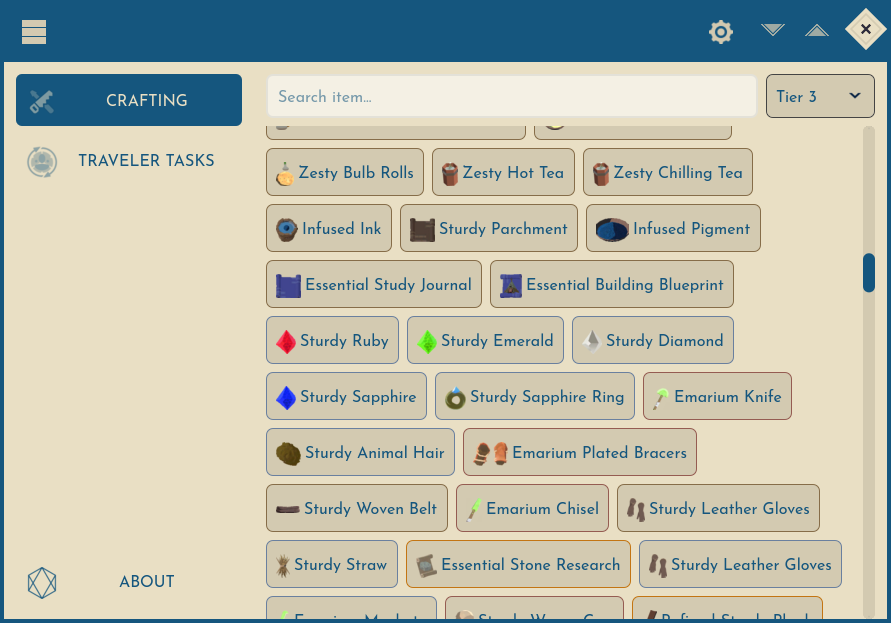
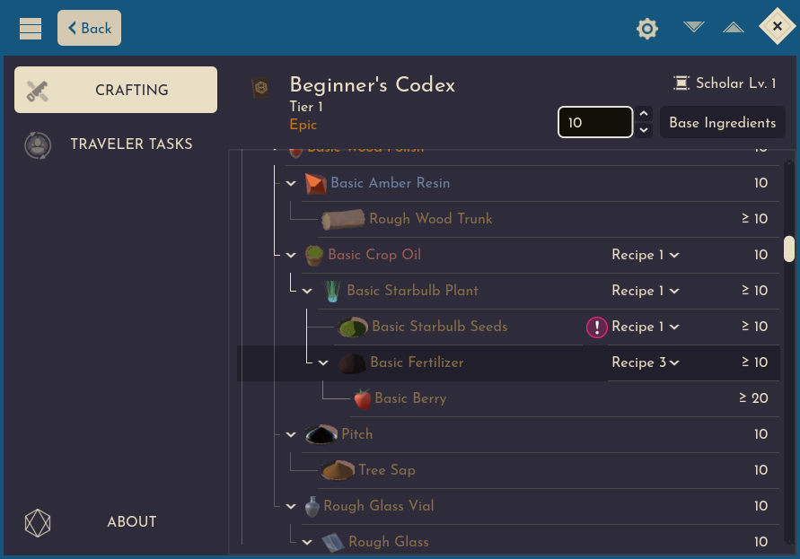
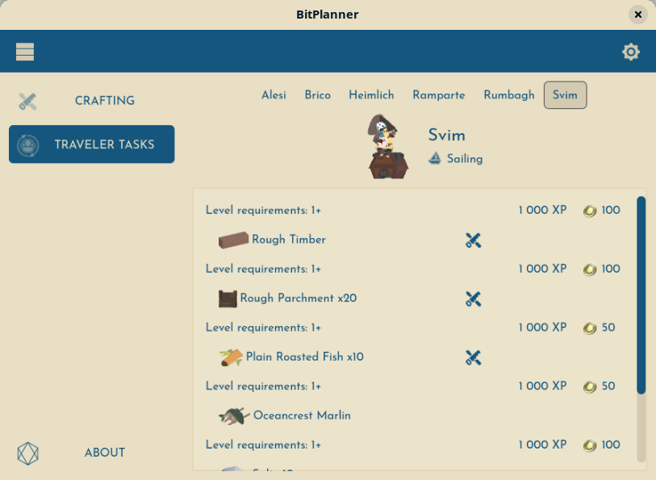
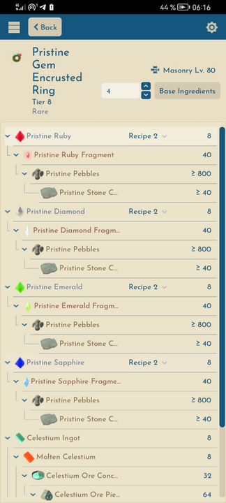

# BitPlanner

**BitPlanner** is a helper application for [BitCraft Online](https://bitcraftonline.com/) players. It works fully offline, available for Windows, Linux, OSX and Android. Features:

* Crafting calculator
  * Shows recipes for all items in the game
  * Allows to change a recipe for any item in a generated tree if there are multiple recipes for the item
  * Produces a list of all base ingredients summarized, easy to copy as plain text or CSV to paste the list into Google Sheets (click *Data > Split text to columns* to transform pasted text into a table)
* Lists of all Traveler Tasks

Statistics calculator with gathering time and effort calculations and other tools are planned for the future.

### [Download](https://github.com/fsobolev/BitPlanner/releases/latest)

## Legal notice

* This application uses assets from the BitCraft Online videogame for non-commercial informational purposes. It is believed that this constitutes a "fair use" of such copyrighted materials. BitCraft Online is developed by Clockwork Labs, Inc. All BitCraft Online trademarks and assets belong to their respective owners.
* This application uses Josefin Sans font, released under terms of [Open Font License](BitPlanner/Assets/Font/LICENSE.OFL)
* Source code of the application is available under terms of [The Unlicense](LICENSE)

## Contributing to the project

* If you want to suggest a feature request or create a bug report, feel free to use [issues](https://github.com/fsobolev/BitPlanner/issues) or [discussions](https://github.com/fsobolev/BitPlanner/discussions). It's highly recommended to create one issue per request or report; if you want to write multiple suggestions at once, better create a discussion.
* You can suggest code changes by creating a pull request. By making such contribution you agree that your code will be dedicated to public domain according to [The Unlicense](LICENSE).

## Building the application

This application is created using [Godot game engine](https://godotengine.org/) v4.4.1. Take note you must use .NET edition of the engine, the regular edition doesn't support building with C# code. Information about using Godot with C# can be found [in the documentation](https://docs.godotengine.org/en/stable/tutorials/scripting/c_sharp/index.html). C# support in the built-in code editor is limited, look [at this page](https://docs.godotengine.org/en/stable/tutorials/scripting/c_sharp/c_sharp_basics.html#configuring-an-external-editor) to configure Godot to use external editor for code.

## Navigating the source code

* `GameData` directory contains a submodule pointing to repository with BitCraft game data in JSON format, as well as scripts that are used to convert that data into different JSON files used by BitPlanner. `generate_data.sh` runs all scripts and writes version of the data. This is only necessary to run after updating the game data or changing the scripts, the content of `GameData` is not included into the application.
* `BitPlanner` directory contains sources for the application itself, it's a Godot game engine project:
  * `Assets` directory contains non-code resources (mostly icons extracted from the official game client and downscaled);
  * `Helpers` directory is for classes that are used for getting various data without creating a specific model or attaching to a Godot scene node;
  * `Models` contains models classes to work with the game data and application settings;
  * `Scenes` contains Godot engine scene files and scripts attached to root nodes of scenes with matching name.
